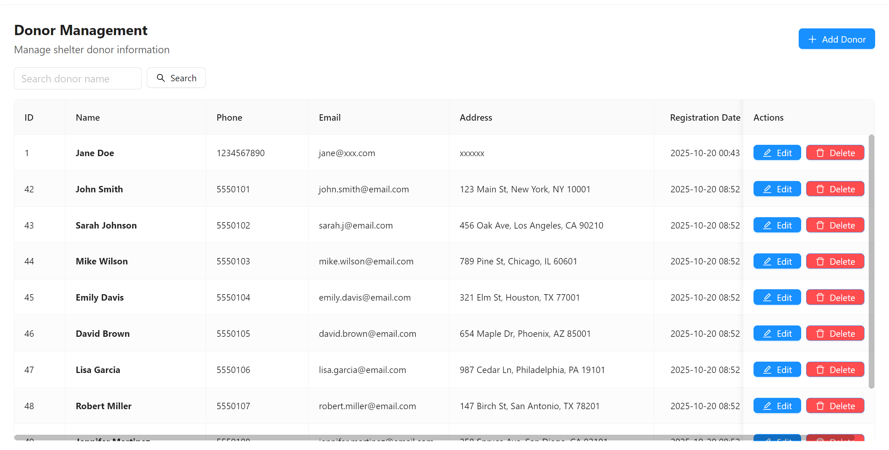
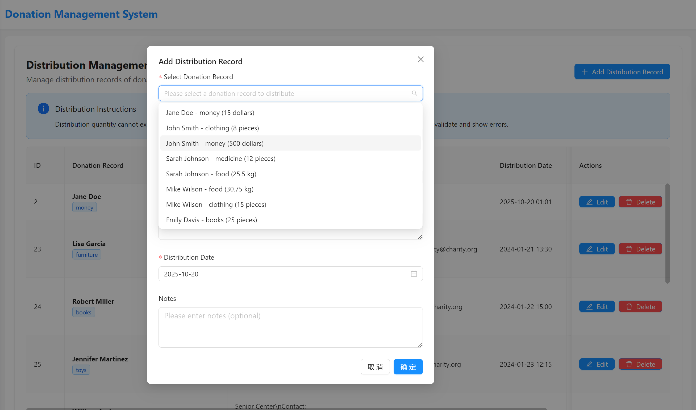
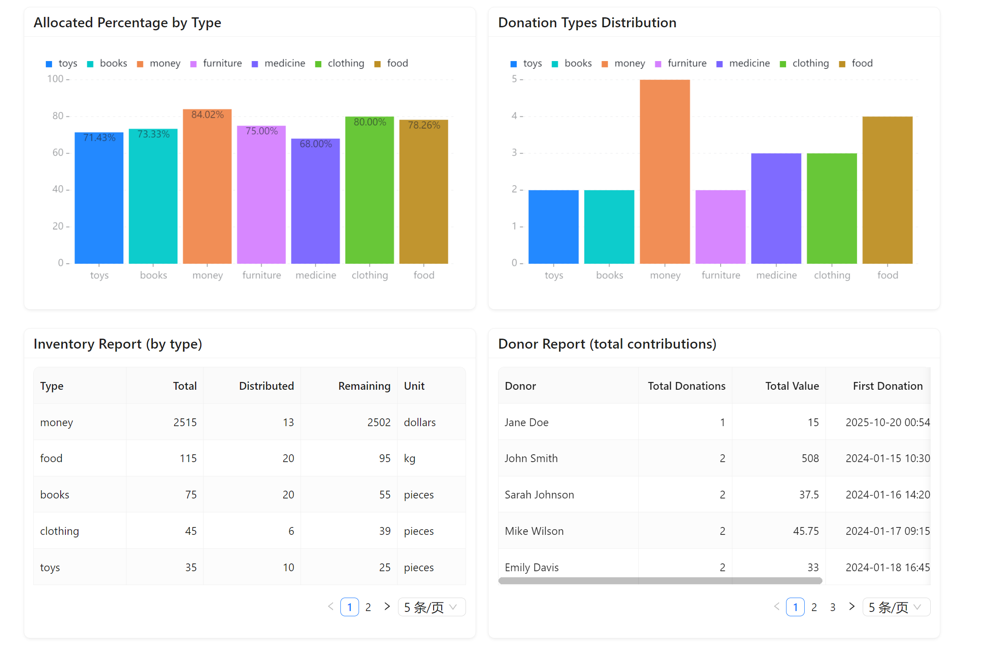
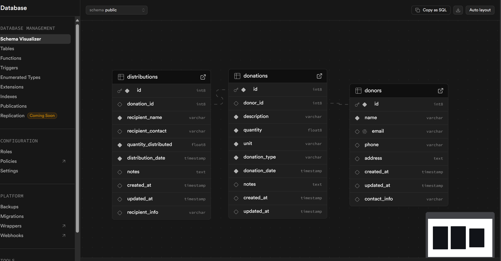

# Donation Management System

A donation management system designed for local shelters, built using TypeScript + Spring Boot + PostgreSQL technology stack.

## 🎯 Project Overview

This system is specifically designed for shelters to help manage the receipt, distribution, and statistics of donated items. The system adopts a modern front-end and back-end separation architecture, providing an intuitive user interface and powerful data management capabilities.

## ✨ Features

### Core Features
- **👥 Donor Management**: Record and manage donor information
- **🎁 Donation Registration**: Record various types of donated items and amounts
- **📤 Donation Distribution**: Track the distribution of donated items
- **📊 Inventory Reports**: Real-time display of inventory status for various donations
- **📈 Donor Reports**: Summary of contributions from each donor

### System Features
- 🔒 **Data Validation**: Automatically validate that distribution quantities do not exceed remaining inventory
- 📱 **Responsive Design**: Support for desktop and mobile device access
- 🎨 **Modern UI**: Beautiful interface based on Ant Design
- ⚡ **Real-time Updates**: Data changes are reflected in real-time on the interface
- 🔍 **Smart Search**: Support for fuzzy search of donors and donation records






## 🛠 Technology Stack

### Frontend
- **TypeScript** - Type-safe JavaScript
- **React 18** - Modern user interface library
- **Ant Design** - Enterprise-level UI component library
- **Axios** - HTTP client
- **React Router** - Single-page application routing

### Backend
- **Spring Boot 3.2** - Java enterprise framework
- **Spring Data JPA** - Data access layer
- **Spring Validation** - Data validation
- **PostgreSQL** - Relational database

### Development Tools
- **Maven** - Backend build tool
- **npm** - Frontend package manager
- **TypeScript Compiler** - TypeScript compilation

## 📁 Project Structure

```
donation-management-system/
├── backend/                    # Spring Boot Backend
│   ├── src/main/java/com/donation/
│   │   ├── DonationApplication.java    # Main application class
│   │   ├── entity/                    # Database entities
│   │   │   ├── Donor.java
│   │   │   ├── Donation.java
│   │   │   └── Distribution.java
│   │   ├── repository/                # Data access layer
│   │   │   ├── DonorRepository.java
│   │   │   ├── DonationRepository.java
│   │   │   └── DistributionRepository.java
│   │   ├── service/                   # Business logic layer
│   │   │   ├── DonorService.java
│   │   │   ├── DonationService.java
│   │   │   ├── DistributionService.java
│   │   │   └── ReportService.java
│   │   ├── controller/                # REST API controllers
│   │   │   ├── DonorController.java
│   │   │   ├── DonationController.java
│   │   │   ├── DistributionController.java
│   │   │   └── ReportController.java
│   │   └── dto/                      # Data transfer objects
│   │       ├── DonorDTO.java
│   │       ├── DonationDTO.java
│   │       ├── DistributionDTO.java
│   │       ├── InventoryReportDTO.java
│   │       └── DonorReportDTO.java
│   ├── src/main/resources/
│   │   └── application.yml            # Configuration file
│   └── pom.xml                       # Maven configuration
├── frontend/                         # TypeScript Frontend
│   ├── src/
│   │   ├── components/               # React components
│   │   ├── pages/                   # Page components
│   │   │   ├── Dashboard.tsx
│   │   │   ├── DonorManagement.tsx
│   │   │   ├── DonationManagement.tsx
│   │   │   ├── DistributionManagement.tsx
│   │   │   └── Reports.tsx
│   │   ├── services/                # API services
│   │   │   └── api.ts
│   │   ├── types/                   # TypeScript type definitions
│   │   │   └── index.ts
│   │   ├── App.tsx                  # Main application component
│   │   ├── index.tsx                # Entry file
│   │   └── index.css                # Global styles
│   ├── package.json                 # Frontend dependency configuration
│   └── tsconfig.json                # TypeScript configuration
└── README.md                        # Project documentation
```

## 🚀 Quick Start

### Environment Requirements

Make sure your system has the following software installed:

- **Java 17+** - Backend runtime environment
- **Node.js 16+** - Frontend runtime environment
- **PostgreSQL 13+** - Database
- **Maven 3.6+** - Backend build tool

### Database Setup

#### Option 1: Use Free Cloud PostgreSQL (Recommended)

1. **Create Supabase Account**:
   - Visit [Supabase](https://supabase.com)
   - Click "Start your project" or "Sign up"
   - Register with GitHub account (recommended)

2. **Create New Project**:
   - After logging in, click "New Project"
   - Fill in project information:
     - **Name**: `donation-management`
     - **Database Password**: Set a strong password (remember this password)
     - **Region**: Choose the region closest to you (e.g., Asia Pacific)
   - Click "Create new project"

3. **Get Database Connection Information**:
   - After project creation, enter the project dashboard
   - Click "Settings" → "Database" in the left menu
   - In the "Connection info" section, find:
     - **Host**: Like `db.xxxxxxxxxxxxx.supabase.co`
     - **Database name**: `postgres`
     - **Port**: `5432`
     - **Username**: `postgres`
     - **Password**: The password you set earlier

4. **Update Configuration File**:
   Edit `backend/src/main/resources/application.yml` file:
   ```yaml
   spring:
     datasource:
       url: jdbc:postgresql://your-host.supabase.co:5432/postgres
       username: postgres
       password: your_supabase_password
       driver-class-name: org.postgresql.Driver
   ```

### Starting the Application

#### 1. Start Backend Service

```bash
# Enter backend directory
cd backend

# Install dependencies and start
mvn clean install
mvn spring-boot:run
```

Backend service will start at **http://localhost:8080**

#### 2. Start Frontend Application

```bash
# Enter frontend directory
cd frontend

# Install dependencies
npm install

# Start development server
npm start
```

Frontend application will start at **http://localhost:3000**

## 📚 API Documentation

### Donor Management
- `GET /api/donors` - Get all donors
- `GET /api/donors/{id}` - Get donor by ID
- `GET /api/donors/search?name={name}` - Search donors
- `POST /api/donors` - Create new donor
- `PUT /api/donors/{id}` - Update donor information
- `DELETE /api/donors/{id}` - Delete donor
- `GET /api/donors/count` - Get total donor count

### Donation Record Management
- `GET /api/donations` - Get all donation records
- `GET /api/donations/{id}` - Get donation record by ID
- `GET /api/donations/donor/{donorId}` - Get records for specific donor
- `GET /api/donations/type/{type}` - Get records of specific type
- `POST /api/donations` - Create new donation record
- `PUT /api/donations/{id}` - Update donation record
- `DELETE /api/donations/{id}` - Delete donation record
- `GET /api/donations/inventory/summary` - Get inventory summary

### Distribution Record Management
- `GET /api/distributions` - Get all distribution records
- `GET /api/distributions/{id}` - Get distribution record by ID
- `GET /api/distributions/donation/{donationId}` - Get distribution records for specific donation
- `POST /api/distributions` - Create new distribution record
- `PUT /api/distributions/{id}` - Update distribution record
- `DELETE /api/distributions/{id}` - Delete distribution record
- `GET /api/distributions/donation/{donationId}/remaining` - Get remaining quantity

### Reports & Statistics
- `GET /api/reports/inventory` - Get inventory report
- `GET /api/reports/donors` - Get donor report
- `GET /api/reports/statistics` - Get system statistics

## 💾 Database Design

### Table Structure

#### 1. donors (Donor Table)
```sql
CREATE TABLE donors (
    id BIGSERIAL PRIMARY KEY,
    name VARCHAR(100) NOT NULL,
    contact_info VARCHAR(200),
    created_at TIMESTAMP DEFAULT CURRENT_TIMESTAMP
);
```

#### 2. donations (Donation Record Table)
```sql
CREATE TABLE donations (
    id BIGSERIAL PRIMARY KEY,
    donor_id BIGINT NOT NULL REFERENCES donors(id),
    donation_type VARCHAR(50) NOT NULL,
    quantity DECIMAL(15,2) NOT NULL,
    unit VARCHAR(20) DEFAULT 'pieces',
    description TEXT,
    donation_date TIMESTAMP DEFAULT CURRENT_TIMESTAMP
);
```

#### 3. distributions (Distribution Record Table)
```sql
CREATE TABLE distributions (
    id BIGSERIAL PRIMARY KEY,
    donation_id BIGINT NOT NULL REFERENCES donations(id),
    quantity_distributed DECIMAL(15,2) NOT NULL,
    recipient_info VARCHAR(200),
    distribution_date TIMESTAMP DEFAULT CURRENT_TIMESTAMP,
    notes TEXT
);
```

## 🔧 Development Guide

### Adding New Features

1. **Backend Development**:
   - Create entity classes in the `entity` package
   - Create data access interfaces in the `repository` package
   - Implement business logic in the `service` package
   - Create REST APIs in the `controller` package

2. **Frontend Development**:
   - Define TypeScript types in the `types` package
   - Add API calls in the `services` package
   - Create page components in the `pages` package
   - Create reusable components in the `components` package

### Code Standards

- **Backend**: Follow Spring Boot best practices
- **Frontend**: Use TypeScript strict mode
- **Database**: Use camelCase naming convention
- **API**: RESTful design principles

## 🚀 Deployment Instructions

### Production Environment Deployment

#### Backend Deployment
```bash
# Build JAR file
mvn clean package -Pprod

# Run JAR file
java -jar target/donation-management-backend-1.0.0.jar
```

#### Frontend Deployment
```bash
# Build production version
npm run build

# Deploy build directory to web server
```

## 📊 Sample Data

The project includes three sample CSV files for testing:

1. **sample_donors.csv** - Sample donor data (10 donors)
2. **sample_donations.csv** - Sample donation records (15 records)
3. **sample_distributions.csv** - Sample distribution records (15 records)

### Importing Sample Data

1. **Using Supabase Dashboard**:
   - Log into Supabase
   - Go to project → Table Editor
   - For each table, import data:
     - Click "donors" table → "Insert" → "Upload CSV"
     - Click "donations" table → "Insert" → "Upload CSV"
     - Click "distributions" table → "Insert" → "Upload CSV"

2. **Using SQL Commands**:
   ```sql
   -- Import donor data (skip id column, let database auto-generate)
   COPY donors(name, contact_info, created_at) 
   FROM 'sample_donors.csv' 
   DELIMITER ',' 
   CSV HEADER;

   -- Import donation record data
   COPY donations(donor_id, donation_type, quantity, unit, description, donation_date)
   FROM 'sample_donations.csv'
   DELIMITER ','
   CSV HEADER;

   -- Import distribution record data
   COPY distributions(donation_id, quantity_distributed, recipient_info, distribution_date, notes)
   FROM 'sample_distributions.csv'
   DELIMITER ','
   CSV HEADER;
   ```

## 🤝 Contributing

1. Fork the project
2. Create a feature branch (`git checkout -b feature/AmazingFeature`)
3. Commit your changes (`git commit -m 'Add some AmazingFeature'`)
4. Push to the branch (`git push origin feature/AmazingFeature`)
5. Open a Pull Request

## 📄 License

This project is licensed under the MIT License - see the [LICENSE](LICENSE) file for details

## 📞 Contact

For questions or suggestions, please contact:

- Project Issues: [GitHub Issues](https://github.com/your-repo/issues)
- Email: your-email@example.com

## 🙏 Acknowledgments

Thanks to all developers and testers who contributed to this project.

---

**Note**: Please ensure to modify default database passwords and other sensitive configuration information in production environments.
