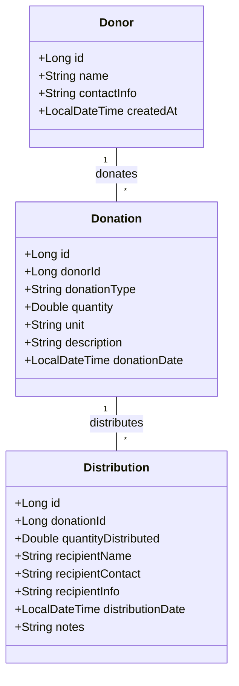
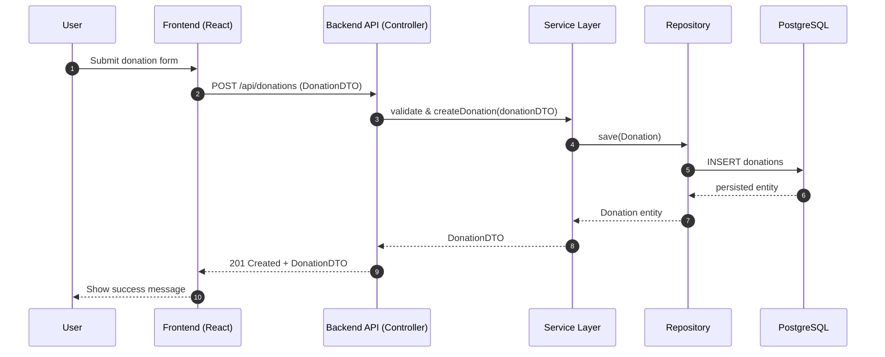
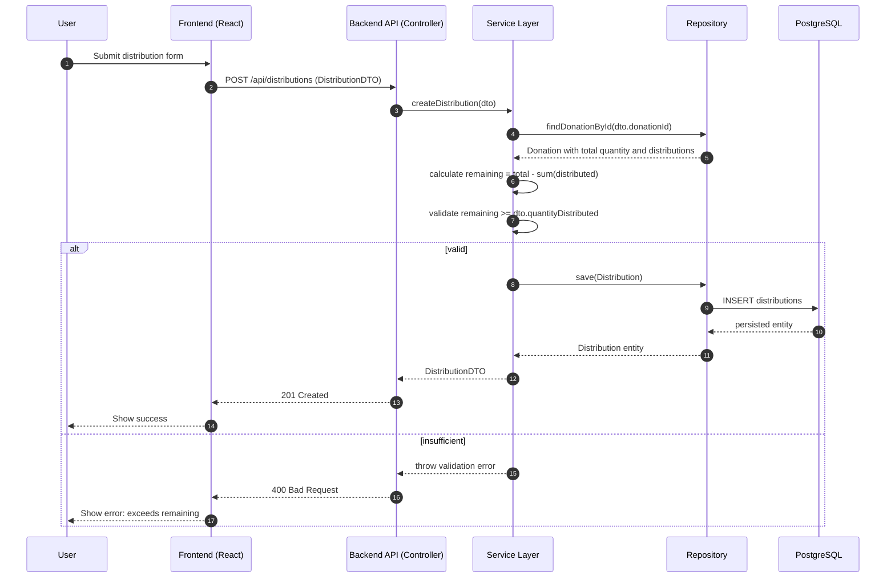

# UML Diagrams for Donation Management System

## Class Diagram


## Component Diagram
```mermaid
flowchart LR
  subgraph Frontend [Frontend (React + TypeScript + Ant Design)]
    UI[Pages & Components]
    APIClient[Axios API Service]
  end

  subgraph Backend [Backend (Spring Boot 3.2)]
    Controller[REST Controllers]
    Service[Service Layer]
    Repository[Repository (JPA)]
    Entity[Entities & DTOs]
  end

  DB[(PostgreSQL)]

  UI --> APIClient
  APIClient -- REST /api --> Controller
  Controller --> Service
  Service --> Repository
  Repository --> DB
```

## Sequence Diagram - Create Donation Flow


## Sequence Diagram - Distribution with Inventory Check

